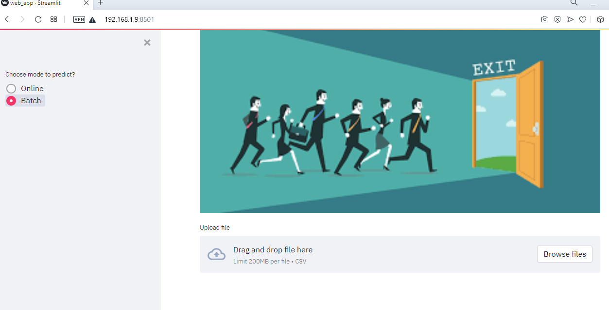

# Capstone_Project
## Churn Prediction Web-App

### Business Problem
Customer Churn is one of the nightmares any organisation wants to see. It incurs expenditures on any organization and loss of brand value. 
To tackle this we need to understand the customer base that are likely to be churned. 
The Customer churn app that we have proposed here predicts the likelihood of customer getting churned or not for telecom managers to buid customer oriented plans and services.

Implementation of projecct building process is done through following steps.

> Research Phase

> Building of Web APP

> Containerisation of Project using Docker

### DataSet
 We have used open source dataset from [Kaggle](https://www.kaggle.com/blastchar/telco-customer-churn). It has 7043 rows (customers) and 21 columns (features).
 
 Brief description of dastaset is as follows ([source](https://www.kaggle.com/blastchar/telco-customer-churn))
- Customers who left within the last month – the column is called Churn
- Services that each customer has signed up for – phone, multiple lines, internet, online security, online backup, device protection, tech support, and streaming TV and movies
- Customer account information – how long they’ve been a customer, contract, payment method, paperless billing, monthly charges, and total charges
- Demographic info about customers – gender, age range, and if they have partners and dependents

### Research Phase

For Research phase we have used Jupyter Notebook `Churn.ipynb` file. This file has the hyperparameter tunning research phase.

### ML Model & Hyperparamter Tunning

As part of preprocessing and feature engineering we used the Scikit-Learn's `Columntransfer`, `Ohe` and `Pipeline` for missing value imputation, standardisation. For Model building we have used Random Forest Classifier because of the presence of categorical input features. Model was serialized by `joblib` package.

Hyperparameter Tunning:  We have used `RandomSearchCV` and used the `clf.best_params_` to use the best tuned hyperparameters.  

### Deployment / Web APP
For building the Web APP we have used `Streamlit` package in `web_app.py` file. 

### Docker
To make the project deployment robust we have used the Docker for containerisation of the project.

**Note**  Streamlit and UTF-8 encoding commands are added to Dockerfile otherwise the web app will show errors.

### **How to Run**

 - Clone this repository and run `python churn_model_train.py`. This will create `model.joblib` (size > 100MB) in project folder which will be used in Web App.
 - Run `streamlit run web_app.py` and wait for ~5 minutes to load the app then visit `NETWORK URL` as shown in cmd
 - For Batch prediction one can use the sample `test_sample.csv`.
 - For Online prediction enter the features values (e.g as provided in `test_sample.json`) in Web APP UI and Click `Predict`.

### Future Scope

  #### Serverless / Cloud Deployment

       After the Docker step one can use the container to run serverless on GCP, AWS etc (Worth mentioning the Cost factor while using the cloud services.)
       Following are the probable ways of running the Web App on 
       `Google Cloud Platform`

       Prerequiste: Enable Google API: $Project-ID, $Container-Registry, $Google-Cloud-Storage

       Some of ways to deploy on `GCP` using following API's
        - Tasks taking long time with pre-configured environment
              `Kubernetes, Dataproc, AI Platform Default/ Vertex-AI`

       - Tasks taking long time with flexible environment
           `AI Platform Custom Training/ Vertex-AI custom Training and Cloud Build`

        - Online job taking few minutes to run with flexible environment
             `Cloud Run, App Engine`

         - Online jobs taking seconds to run with less flexible environment
              `Cloud Function`

         - Scheduled running of jobs
              `Cloud Composer (Airflow), Cloud Scheduler`
         
         - CI/CD 
           For CI/CD as a part of MLOPS one can use Gitlab CI/CD Pipeline (Worth mentioning the Cost factor involved).

  

     
