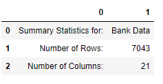

# Capstone_Project
## Churn Prediction Web-App

### Problem Statement
Customer Churn is one of the nightmares any organisation wants to see. It incurs expenditures on any organization and loss of brand value. 
To tackle this we need to understand the customer base that are likely to be churned. 
The Customer churn app that we have proposed here predicts the likelihood of customer getting churned or not for telecom managers to buid customer oriented plans and services.

Implementation of project building process is done through following steps.

> Research Phase

> Building of Web APP

> Containerisation of Project using Docker

### Metric

   In classification predictions model returns results in four types of outcomes that could occur.

>- **True positives** predicticted observation belongs to a correct class.

>- **True negatives** predicticted observation does not belongs to a correct class.

>- **False positives** predicticted observation belongs to a class, however in reality it does not.

>- **False negatives** predicticted observation does not belongs to a class, however in reality it does.

   In this project I have used **Accuracy** as our evaulation metric whic is defined as 

                           Accuracy = TP+TN/TP+FP+FN+TN

### DataSet and Data Exploration
 We have used open source dataset from [Kaggle](https://www.kaggle.com/blastchar/telco-customer-churn). 
 
 Brief description of dastaset is as follows ([source](https://www.kaggle.com/blastchar/telco-customer-churn))
- Customers who left within the last month – the column is called Churn
- Services that each customer has signed up for – phone, multiple lines, internet, online security, online backup, device protection, tech support, and streaming TV and movies
- Customer account information – how long they’ve been a customer, contract, payment method, paperless billing, monthly charges, and total charges
- Demographic info about customers – gender, age range, and if they have partners and dependents

It has 7043 rows (customers) and 21 columns (features).
 
  
  

#### Data Visualization
  For data visualization I checked distribution of the columns through `sns.distplot` 
  
  
  
  
  Donut chart through `matplotlib.pyplot.pie` 
  
  
  
  
  Correlation heatmap of numerical variable
  
  

### Data Preprocessing / Feature Engineering

For Data preprocessing/ feature engineering I have used `Scikit-Learn` pipeline and `ColumnTransformers` (Ref: [Churn.ipynb](https://github.com/akshitagupta23/Udacity_DS_ND_Capstone_Project/blob/main/Churn.ipynb)).

ColumnTransformers performs:
> Missing value imputation
> Scaling of non-bool values by StandardScaler
> One hot encoding for categorical variables

   

### Implementation- ML Model & Hyperparamter Tunning

Python 3.8 (Anaconda 3–64 bit) was used for development and testing. I also used ([Docekr](https://www.docker.com/)) to build the image.
Project Structure looks as follows
       

Excrepts of model training pipeline is as shown below (Ref: [Churn.ipynb](https://github.com/akshitagupta23/Udacity_DS_ND_Capstone_Project/blob/main/Churn.ipynb))

   
   

Excrepts of Churn Web APP from `web_app.py` being build using **Streamlit**

  

**Algorithm**: 
     I have used bagging technique of machine learning training by using [Random Forest Algorithm](https://scikit-learn.org/stable/modules/generated/sklearn.ensemble.RandomForestClassifier.html)
     
   

### Refinement
For Refining the training we have used `RandomSearchCV` to use the best tuned hyperparameters and  `clf.best_params_`  to get the best tuned parameters.

### Results
#### Model Evaluation
As a part of model evaluation I retrain the model using the hyper tunned parameters. This result in improving Recall by 0.2 value.
Result metric as shown below
  
 

### Deployment / Web APP
For building the Web APP we have used `Streamlit` package in `web_app.py` file. 

  #### **How to Run**

   - **Must Do**: Clone this repository and run `python churn_model_train.py`. This will create `model.joblib` (size > 100MB) in project folder which will be used in Web App.
   - Run `streamlit run web_app.py` and wait for ~5 minutes to load the app then visit `NETWORK URL`
   - **Online Prediction** can be done using the `test_sample.json`.
      Expected result shown below

        

   - **Batch Prediction** can be done using the sample `test_sample.csv`
       Expected result shown below

        

### Docker
To make the project deployment robust we have used the Docker for containerisation of the project.
Provided `Dockerfile` can be used to build the image that then can be used in Future Scope section

**Note**  Streamlit and UTF-8 encoding commands are added to Dockerfile otherwise the web app will show errors.

### Future Scope / Improvement

  #### Serverless / Cloud Deployment

       After the Docker step one can use the container to run serverless on GCP, AWS etc (Worth mentioning the Cost factor while using the cloud services.)
       Following are the probable ways of running the Web App on 
       `Google Cloud Platform`

       Prerequiste: Enable Google API: $Project-ID, $Container-Registry, $Google-Cloud-Storage

       Some of ways to deploy on GCP using following API's
       
        - Tasks taking long time with pre-configured environment
              `Kubernetes, Dataproc, AI Platform Default/ Vertex-AI`

       - Tasks taking long time with flexible environment
           `AI Platform Custom Training/ Vertex-AI custom Training and Cloud Build`

        - Online job taking few minutes to run with flexible environment
             `Cloud Run, App Engine`

         - Online jobs taking seconds to run with less flexible environment
              `Cloud Function`

         - Scheduled running of jobs
              `Cloud Composer (Airflow), Cloud Scheduler`
         
    - CI/CD 
        For CI/CD as a part of MLOPS one can use Gitlab CI/CD Pipeline (Worth mentioning the Cost factor involved).

  
     
