# Capstone_Project
## Churn Prediction Web-App

### Project Overview
Present era of telecom industry tries to lure the customers by providing best offers and services, yet if some customer leaves its telecom provider this becomes pain point that needs to be alleivated. This project understand the customer attrition as a potential pain point of telecom industry. 
It involves building medium like Web APP as UI for telecom leadership and C-suite executives to help them find the rationality of customer decision of leaving. Open source data has been used to build the Web App which is being powered by machine learning at the back end to provide best and in time prediction of the customers.

The document consists of the methodology, results and future scope of scalability of Web-UI. The conclusion is that proposed use of algorithm has been proven to be lightweight and reduces time latency.

### Problem Statement
Customer Churn is one of the nightmares any organisation wants to see. It incurs expenditures on any organization and loss of brand value. 
To tackle this we need to understand the customer base that are likely to be churned. 
The Customer churn app that we have proposed here predicts the likelihood of customer getting churned or not for telecom managers to buid customer oriented plans and services.

Implementation of project building process is done through following steps.

> Research Phase

> Building of Web APP

> Containerisation of Project using Docker

### Metric

   In classification predictions model returns results in four types of outcomes that could occur.

>- **True positives** predicticted observation belongs to a correct class.

>- **True negatives** predicticted observation does not belongs to a correct class.

>- **False positives** predicticted observation belongs to a class, however in reality it does not.

>- **False negatives** predicticted observation does not belongs to a class, however in reality it does.

 In this project I have used accuracy as our evaulation metric since data set was not heavily imbalanced other wise PR curve would have been the best fit. Another reason for choosing the accuracy is that since the project is of nature of MVS(minimum viable service) and it helps leaders and strategy building team of a telecom organisation to frame best offers for customers so accuracy as metric will serve as ROI measurement.  
Accuracy is defined as 

                           Accuracy = TP+TN/TP+FP+FN+TN
   

### DataSet and Data Exploration
 We have used open source dataset from [Kaggle](https://www.kaggle.com/blastchar/telco-customer-churn). 
 
 Brief description of dastaset is as follows ([source](https://www.kaggle.com/blastchar/telco-customer-churn))
- Customers who left within the last month – the column is called Churn
- Services that each customer has signed up for – phone, multiple lines, internet, online security, online backup, device protection, tech support, streaming TV and movies
- Customer account information – how long they’ve been a customer, contract, payment method, paperless billing, monthly charges, and total charges
- Demographic info about customers – gender, age range, and if they have partners and dependents

It has 7043 rows (customers) and 21 columns (features).
 
  
  

#### Data Visualization
  For data visualization I checked distribution of the columns through `sns.distplot` 
  
  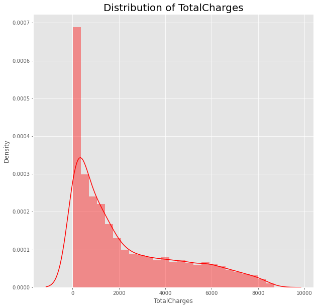
  
  
  Donut chart through `matplotlib.pyplot.pie` 
  
  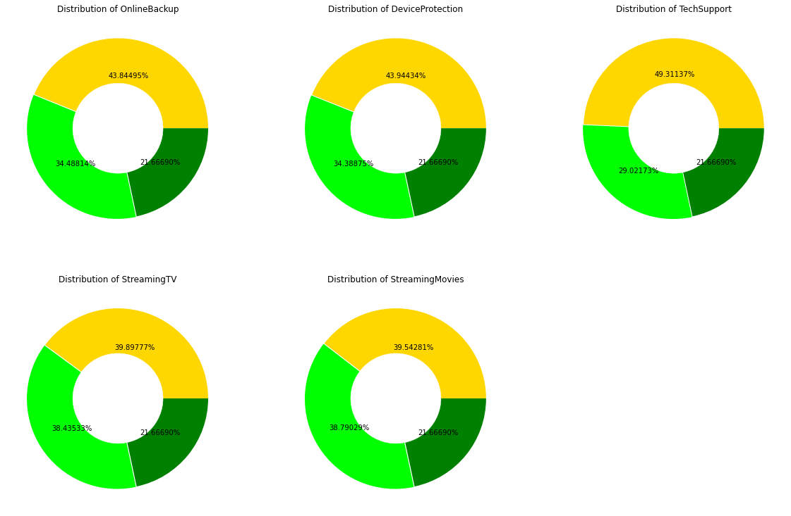
  
  
  Correlation heatmap of numerical variable
  
  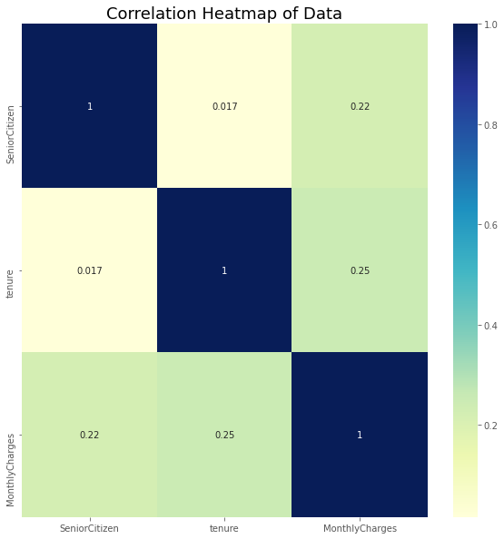

### Data Preprocessing / Feature Engineering

For Data preprocessing/ feature engineering I have used Scikit-Learn's `Pipeline` and `ColumnTransformers` (Ref: [Churn.ipynb](https://github.com/akshitagupta23/Udacity_DS_ND_Capstone_Project/blob/main/Churn.ipynb)).

ColumnTransformers performs:
> Missing value imputation

> Scaling of non-bool values by StandardScaler

> One hot encoding for categorical variables

   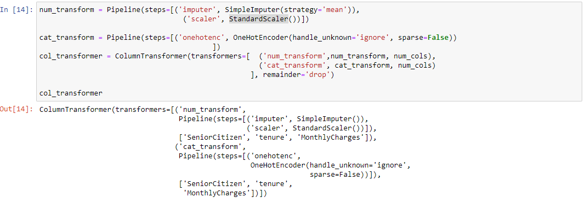

### Implementation- ML Model & Hyperparamter Tunning

Python 3.8 (Anaconda 3–64 bit) was used for development and testing. I also used ([Docekr](https://www.docker.com/)) to build the image.
Project Structure looks as follows
       
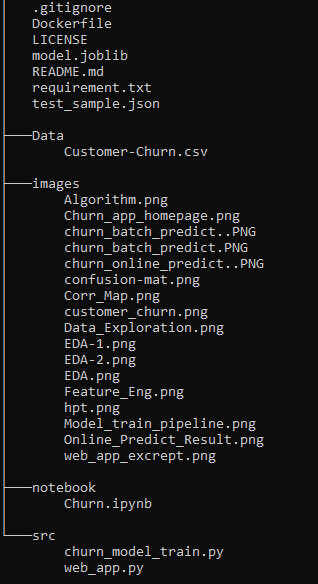

Excrepts of model training pipeline is as shown below (Ref: [Churn.ipynb](https://github.com/akshitagupta23/Udacity_DS_ND_Capstone_Project/blob/main/Churn.ipynb))

   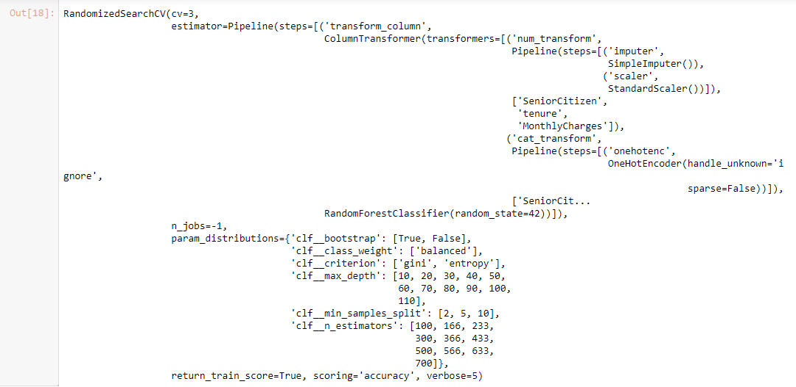
   

Excrepts of Churn Web APP from `web_app.py` being build using **Streamlit**

  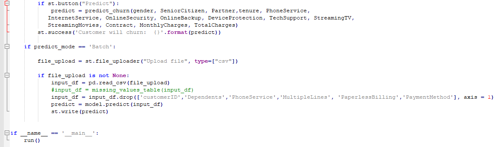

**Algorithm**: 
     I have used bagging technique of machine learning training by using [Random Forest Algorithm](https://scikit-learn.org/stable/modules/generated/sklearn.ensemble.RandomForestClassifier.html)
     
   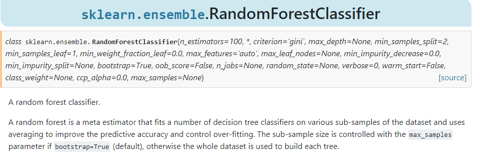

### Refinement
For Refining the training we have used `RandomSearchCV` to use the best tuned hyperparameters and  `clf.best_params_`  to get the best tuned parameters.
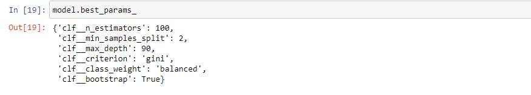

### Results
#### Model Evaluation
As a part of model evaluation I retrain the model using the hyper tunned parameters. This result in improving Recall by 0.2 value.
Result metric as shown below
  
 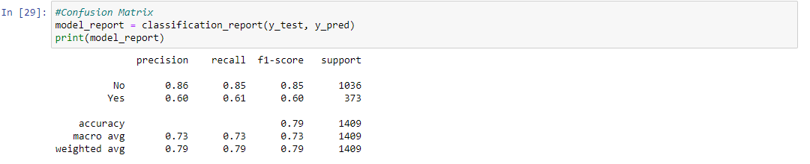

### Justification 
For this project as mentioned in Metric I wanted to build an MVS(minimum viable service) project which will also have the easy scalability(as mentioned in Future Scope) thus I have taken Random Forest Algorithim. Using this algorithm not only provided the accuracy but also have increased the Recall with minimum set of hyperparameter tunning.

Another reason was to reduce the time taken by Web-UI to load and also to use the minimum compute resources for scaling th MVS to cloud like GCP for future scope, however if algorithm like Xgboost or Neural Networks (NN) have been used then they might have given the better result but will be costing the computation time.

### Deployment / Web APP
For building the Web APP we have used `Streamlit` package in `web_app.py` file. 

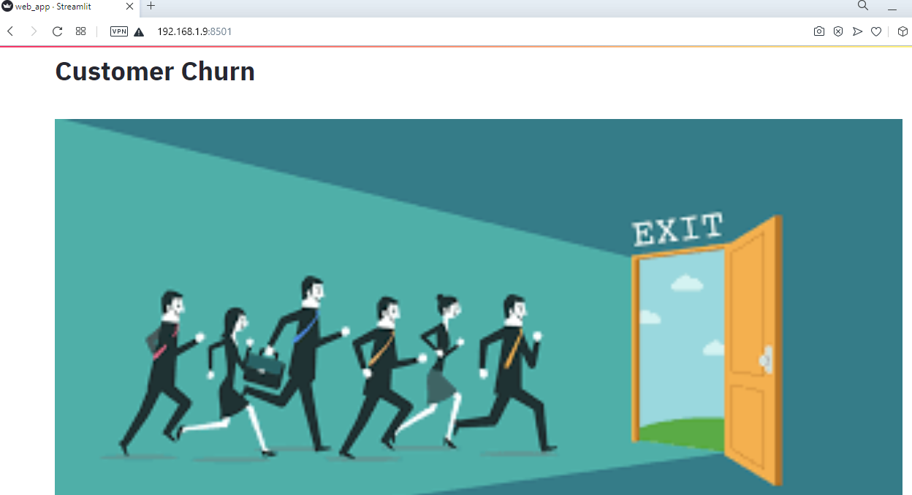

  #### **How to Run**

   - **Must Do**: Clone this repository and run `python churn_model_train.py`. This will create `model.joblib` (size > 100MB) in project folder which will be used in Web App.
   - Run `streamlit run web_app.py` and wait for ~5 minutes to load the app then visit `NETWORK URL`
   - **Online Prediction** can be done using the `test_sample.json`.
      Expected result shown below

        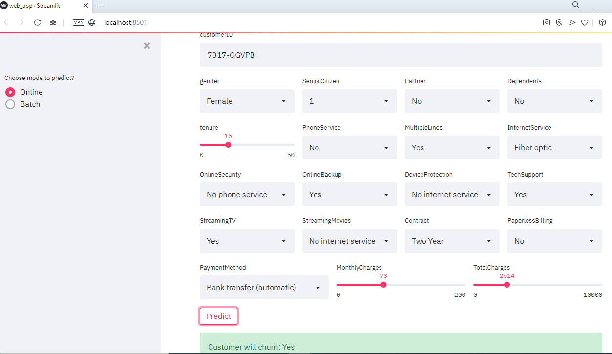

   - **Batch Prediction** can be done using the sample `test_sample.csv`
       Expected result shown below

        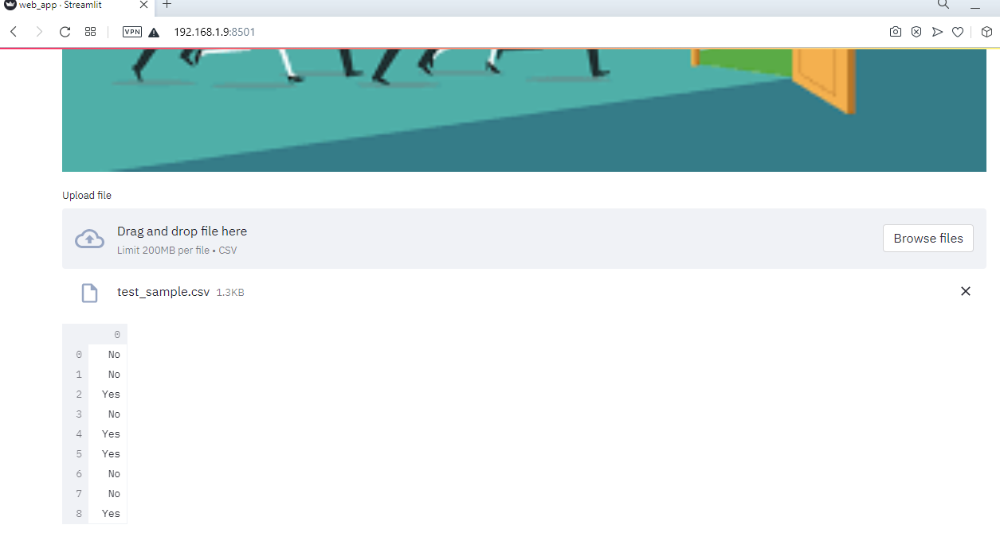

### Docker
To make the project deployment robust we have used the Docker for containerisation of the project.
Provided `Dockerfile` can be used to build the image that then can be used in Future Scope section

**Note**  Streamlit and UTF-8 encoding commands are added to Dockerfile otherwise the web app will show errors.

### Reflection

Data being the new oil of present world has enticed me in pursuing my interest in data science at the first place. This project has helped in implementing the CRISP-DM lifecycle. It was a challenging project since I explored the option of containersization through Docker and building of Web-UI using python Streamlit package. 
Interesting to see if how the neural networks using tensorflow would have improved the model performance also to observe the impact of neural networks on the App response time if MVS goes to production.

### Improvement
Customer churn prediction could be improved by one or ensemble of various algorithms like NB, SVM, Xgboost and MLP through weighted average.  
For scalability of the project I have proposed some ways of serverless deployment on GCP of the app so that the app caters to the prediciton on real time streaming data. 
Also A/B testing could be used to check the performance of the different models. 

Use of model interpretion packages and tools like LIME, SHAP, WHAT-IF can help to answer the questions of whether a model is ethical or not. 

  ##### Serverless / Cloud Deployment

       After the Docker step one can use the container to run serverless on GCP, AWS etc (Worth mentioning the Cost factor while using the cloud services.)
       Following are the probable ways of running the Web App on 
       `Google Cloud Platform`

       Prerequiste: Enable Google API: $Project-ID, $Container-Registry, $Google-Cloud-Storage

       Some of ways to deploy on GCP using following API's
       
        - Tasks taking long time with pre-configured environment
              `Kubernetes, Dataproc, AI Platform Default/ Vertex-AI`

       - Tasks taking long time with flexible environment
           `AI Platform Custom Training/ Vertex-AI custom Training and Cloud Build`

        - Online job taking few minutes to run with flexible environment
             `Cloud Run, App Engine`

         - Online jobs taking seconds to run with less flexible environment
              `Cloud Function`

         - Scheduled running of jobs
              `Cloud Composer (Airflow), Cloud Scheduler`
         
    - CI/CD 
        For CI/CD as a part of MLOPS one can use Gitlab CI/CD Pipeline (Worth mentioning the Cost factor involved).

  
     
